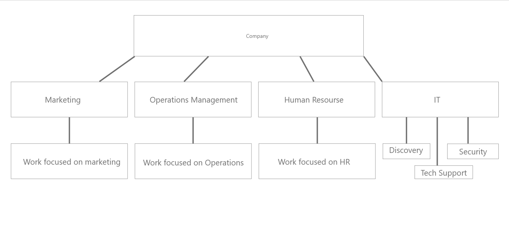

# Activity 1.4

* Minimizing confusion over job expectations by having an organizational structure allow an organization an to help co-ordinate activities by clearly identifying which individuals or divisions are responsible for which tasks
* Allows growth of the company through delegation, coordination, and collaboration of different divisions
* Divisions allow companies to put more time and resources into company needs through divisions working together towards a common goal while still focusing on what they specialize in.
* Having roles focused entirely on innovation within an IT business can affect the structure of the business by: 
* Having divisions dedicated to maintaining the existing needs of the company while allowing other divisions to work on discovering new technology or existing existing tech.

Here you can see that the company is able to hire specialists for each division, and those divisions can focus solely on their intended roles, making the company more efficient as a whole. The companies organized structure allows growth.

