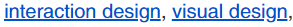
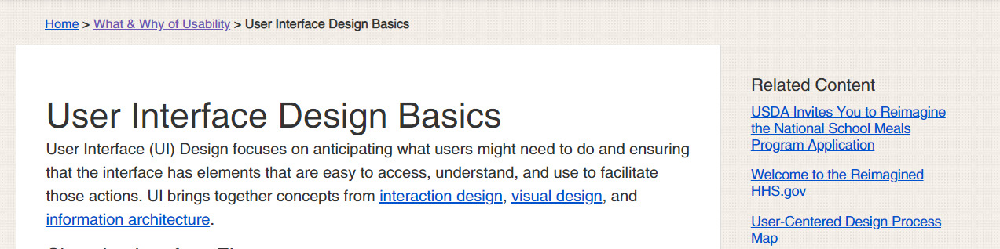
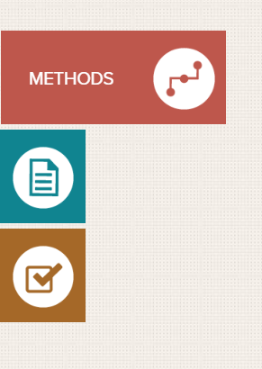
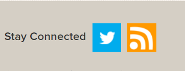

# Activity 5.1

1. Explain in your own words what interface elements are

* Interface elements are basically all of the smaller elements on a page that can display information, do something when clicked, serve a set purpose. Interface elements are things like buttons, drop down menus, search bars, tool-tips, what happens when you hover over a certain area of your page \(e.g hovering makes the button darken and show buttons that open a menu. these are all interface elements.
* Pages are made up of multiple different elements, all working together to make the page look better, or to make it more accessible, or easier on the user.
* "sometimes elements that can help save you space, put more of a burden on the user mentally by forcing them to guess what is within the drop-down or what the element might be." -_UI Design Basics._

A good interface is simple, consistent, purposeful in it's layout, uses color and typography to make the page easier to understand and give it structure, make sure the system informs the user of what's happening.

Interface elements include but are not limited to:

* **Input Controls**: buttons, text fields, check-boxes, radio buttons, drop-down lists, list boxes, toggles, date field.
* **Navigational Components**: breadcrumb, slider, search field, pagination, slider, tags, icons
* **Informational Components**: tool-tips, icons, progress bar, notifications, message boxes, modal windows.
* **Containers**: accordion

We have become very used to a set type of layout for our web pages, so it is good to stick with these elements as to not confuse the user \(example, exit button top right, with minimize and expand window, a back button will go back a page\).

2. Choose at least 4 of the elements introduced in the article and find and upload screenshot examples of each

Here we can see how typography gives the page structure, the bigger and bolder heading make you know that that is the name or topic of the following writing.   
Also above that, there is an in-order list of the pages that lead up to this page, Home &gt; What & Why of Usability &gt; User Interface Design Basics, and we can see that colour is used to display if the page has been visited by the user before, the What and Why part is more purple, showing that the hyperlink has been clicked previously.

Menus that change colour or appearance when you clock/hover on the menus element with the mouse

Commonly recognized logos acting as hyperlinks to the companies other pages, e.g their Twitter.  

3. Can you also find an example of a where the UI design uses typography to create hierarchy and clarity?  
I think every page uses typography for this, even when coding a website you have headings which will appear larger and more eye catching to a user, follows by the relevant information in a smaller font size.

