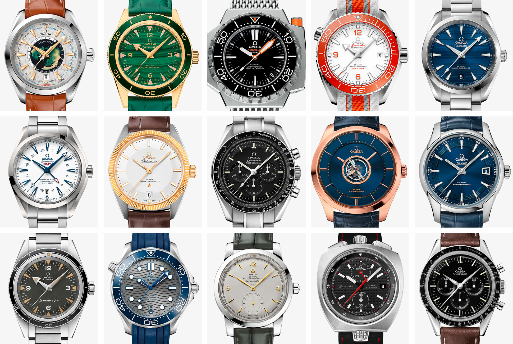
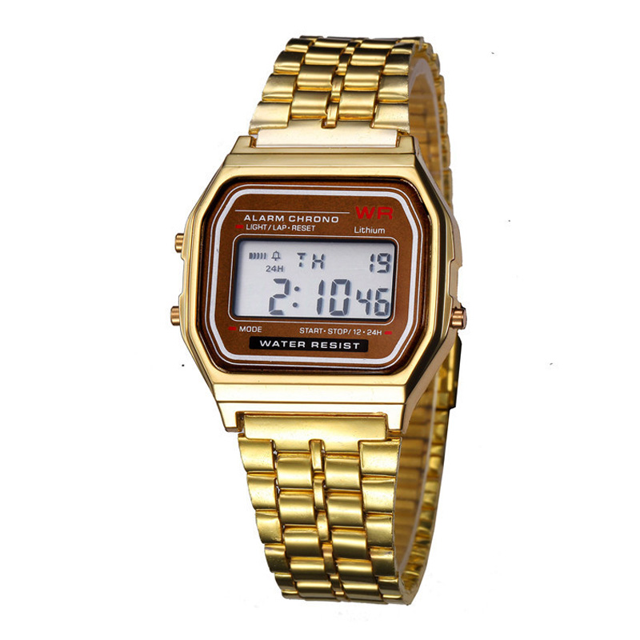
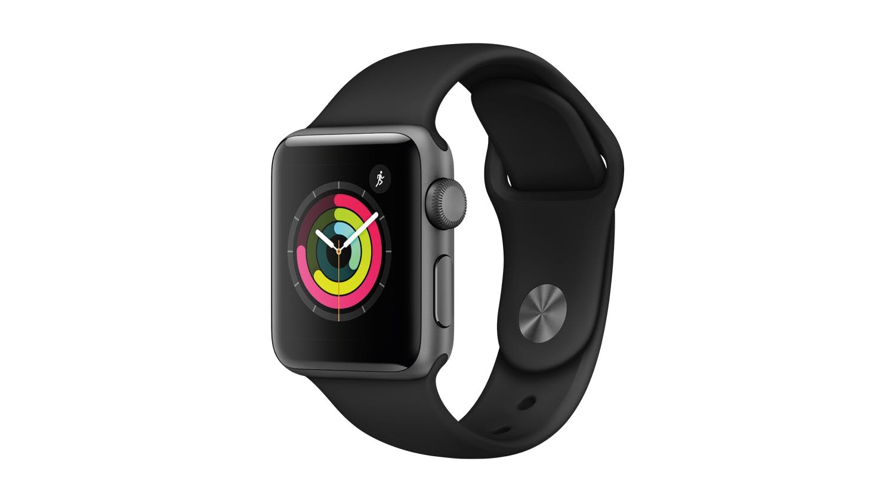
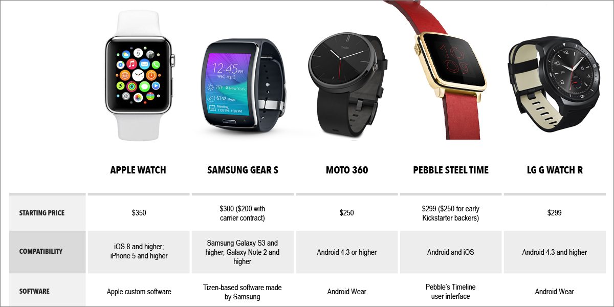
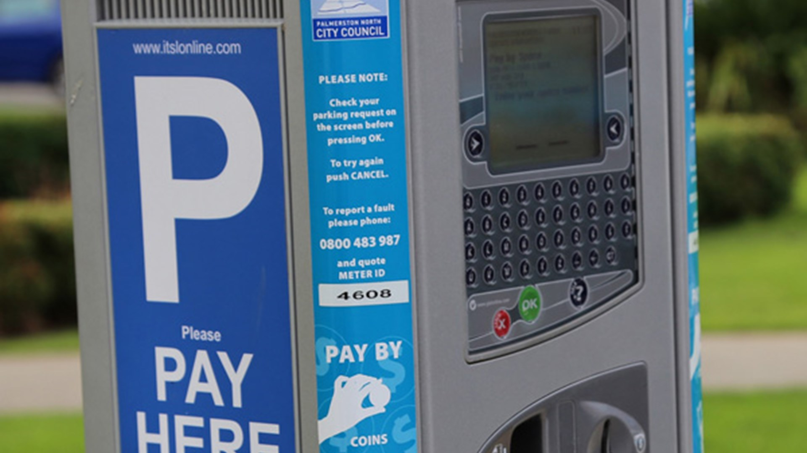

# Activity 5.2

1. Think of at least 4 different technologies where user interface design is an important consideration.
2. Discuss why and/or how the user interface approach for each of these types of devices/technologies needs to differ.

**Watches**: The interface design of watches. Instead of 4 different technologies, for 3 of them I will use watches as an example to show how the UI has evolved over time \(Analog --&gt; Digital --&gt; Smart Watches\).  
  
When dealing with watches there are many different ways that elements can be styled, however the amount of screen space is tiny, so elements must be well organized, and easy to use.

1. Analog Watches

Analog watches display the time similar to a clock. In comparison to newer models, the analog watch is quite simple. Commonly only having 1 turn dial that is used to set the correct time. The main UI design elements I can see are 

* Colour: often a simple, easy to look at colour, nothing too flashy or bright \(good design\)
* How to represent the hours 1-12: Some include the numbers, other include only 3,  6, 9, 12, while others can use other symbols or lines to represent the hours \(this must be well designed, as the main purpose of these watches are to tell the time, so if the user can't do that, it's really bad design\)
* The 'hands' of the watch that tell the time: Some are slim, some are thick. Most of the watches above are examples of good design in this aspect, They all use a different colour for the background and the hands, if the hands are the same colour, it will blend in with the background and become difficult to see.
* Some include compasses, often very small and behind the clock itself.
* Small writing, often company or watch name.
* The size of every element differs
* Good symmetry

**2. Digital Watches**

Digital watches display the time in a digital format.  
UI design element:

* Colour: Usually the colour or material of the watch, the screen colour doesn't differ much.
* Use of buttons/dials: Here we see that there are 3 dials on this watch, the functions of these dials are  well explained by the writing on the watch screen \(light/lap-reset\) \(mode\) \(start-stop/ 12hr-24hr\).
* Writing: colour, size, font, necessity \(is it needed\) as there is such little space to work with, only vital elements must be included to keep it simple. Brand name or watch type also included often for marketing purposes.
* The Screen: size of screen, what will be displayed ? In our example we can see the battery life, alarm status, 24hr or 12hr format, the day of the week, the year, the time. and 'mode' would change the whole screen to another layout.

**3. Smart Watches**

Smart watches are a whole different beast, the amount of UI design is increased far beyond previous watch types. These watches are almost like a tiny, portable computer that is designed to look like a regular watch. The leading companies all have their own version of smart watches, each has their own OS designed solely for the smart watch to run, such as Apple Watches "watchOS".  
  
UI Design elements 

* Screen: size, colour, shape, all differ quite a lot.
* Strap: as it's an expensive piece of technology the strap must be designed well and be very strong or not break/come undone accidentally.
* Each individual screen: Idle screen, home screen, and then every other apps screen layouts
* App layout: how are the apps presented through size, colour, imagery, organization
* All of the touchable aspects: must be well designed to be easy for the user to press, people often have fat fingers and pressing a tiny icon on a tiny screen can be difficult, this must be thought about and accounted for during the design process, most likely receives updates often to improve.
* All of the above can come under 'Presentation" how are all these aspects presented, which elements are used, is it a good form of design ?

**4. Parking Meter**

Parking meters are made to helps communities regulate parking spots. Due to each cities choices of different parking systems**,** all meters in different cities are not the same and the user interface of meters are difficult to understand at times. Design can provide a better experience of using parking meters, which helps users to use parking meters more easily.  
The physical design of parking meters varies greatly, depending on the city, area \(road side, parking lot\), size of the parking lot, amount of use, long term/short term.

Here is a common NZ meter, often used for road side or small parking areas, as you can see there is a maximum stay of 2 hours, so intended for short uses and only takes coins or mobile app payment.

* Screen: the size is very small and placed at the top, only displays money value and minimal info.
* Shape: varies depending on multiple things, does it need to be able to hold a lot of coins \(is it checked regularly\), account for screen size, electronics, security features
* Writing: Here we can see there is an example of how to use the machine in words and in pictures, most people will see the coin slot and know that it only accepts coins, if not, the image of a hand putting a coin in should help the user understand. It explains how to pay, by coin or app, the maximum length of stay and weekly hours.
* Size of unit.

Here we have a larger meter, most likely used in a busier, larger parking area.  
The screen displays most the the information, there is help to understand on the sides, company details and info for people who need help is displayed. consistent colours blue, grey. commonly known keyboard, good use of colours, green for yes, red for no/exit \(universal colours, green= go, red = stop\).  
The physical layout also differs between different meters, this one is larger, as it holds more electronics, security features, has more to display, more features, and allows much more use.

