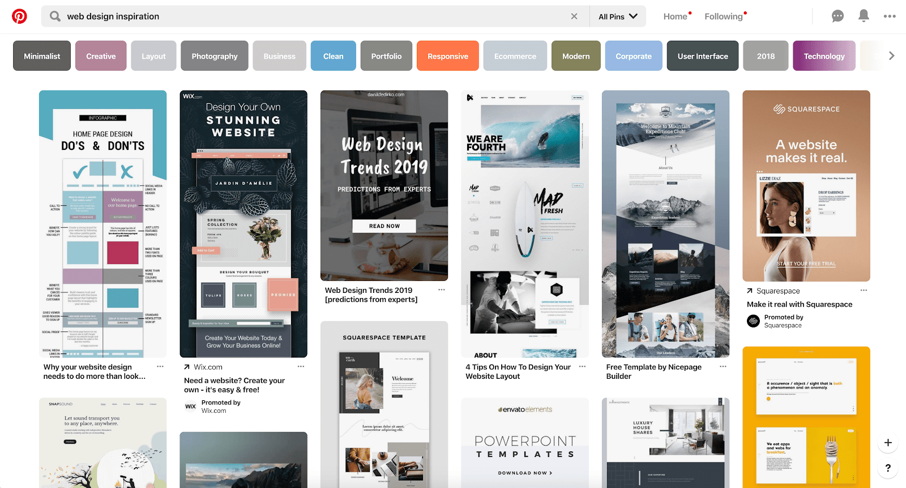

# Activity 6.2

**Design that enhances content**

Find and post at least one online example of each of:

1. _a simple, uncluttered design -_ that is, a web site or page where interface and image elements have a purpose, and text is kept as concise as possible and easy to read.

1. _a consistent design -_ that is, a web site or page where it is obvious to visitors what to do in that the whole site behaves the same way, has consistent navigation and language style, etc.

-Colors change for different areas or the site, but the main elements are kept consistent, same font and headers style, same logo, same login position.

1. _a standard design -_ that is, uses a design layout and navigation that's similar to other web sites so visitors know what to do.

-Pinterest, looks very similar to Google images design \(UI elements\), familiar to people, but made to look more aesthetic.  
Search bar up top, list of categories/filters below that and then a long page of different images which can be clicked on and interacted with.

