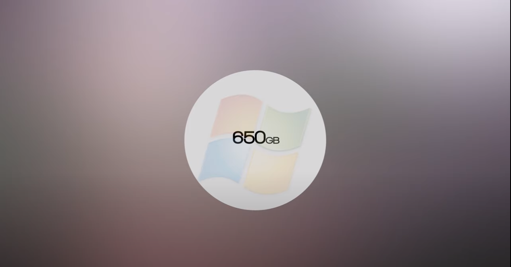
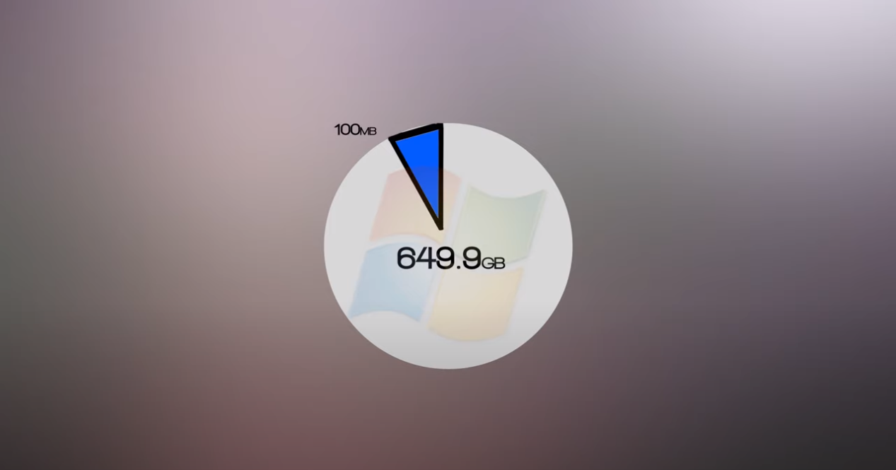
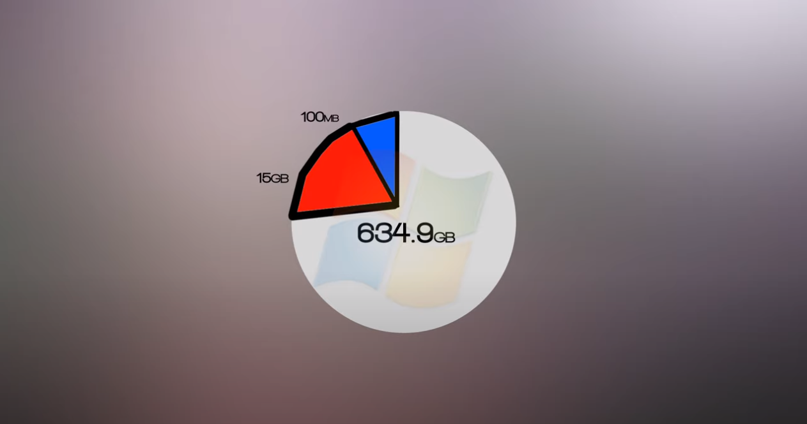
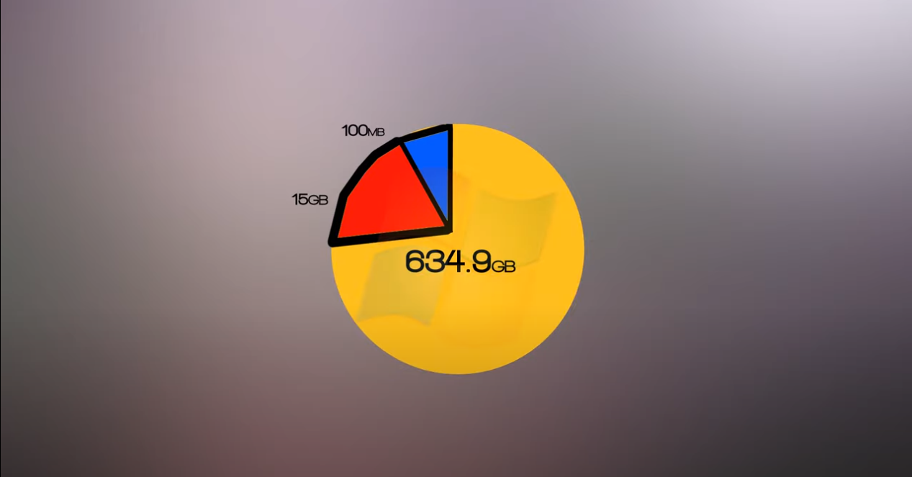
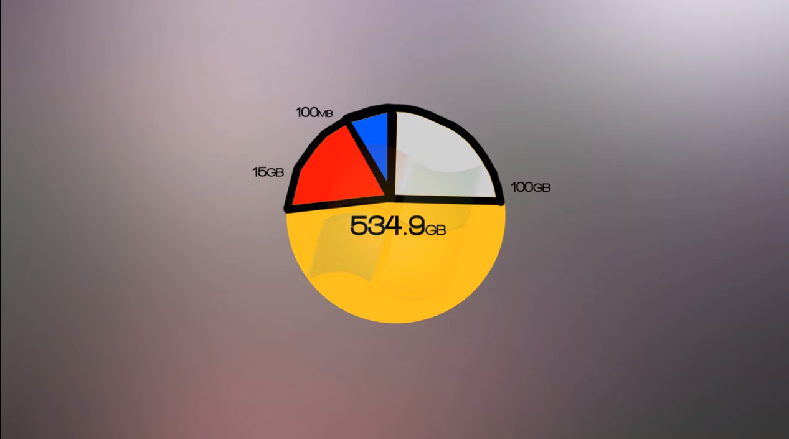

# Operating Systems

**What is a dual boot ?  
-**A dual boot is when one or more operating systems are installed in your computer.   
  
-Operating systems require multiple partitions to store files \(Ex. Windows OS uses 3 partitions to run, so Windows ends up dividing itself into 3 different pieces.  
  
**Dual Boots & Partitions explained:**  
Here, we have 650 GB hard drive.

The first partition is the 'System Reserves" and will be set at 100mb

The the "Recovery Partition" will be made up of 15 GB

Lastly, the Local Files which will be given the rest of the hard drive space.

So in order to run separate OS such as OSX or Linux, you would have to give the OS an allocated partition.

Once the partition has been given to a certain operating system. The dual booting will come into play next time you are booting the computer. Instead of booting straight into Windows/OSx, the computer will ask you which OS you want to boot into.

**File Systems**  
There are many different file systems used throughout operating systems  
-Windows has FAT32 AND NTFC  
-Linux has EXT3 and EXT4  
-BSD has FFS  
-OSX has HFS+  
  
FAT32 is the most widely used file system on less modern computers, and most USB sticks due to its  wide versatility. The compatibility of the FAT32 system is used from Mac, Linux, Windows, all the way to PS3, and in-car GPS systems.

**Virtual Machine  
What?**  
A virtual machine**,** known as a 'guest', is created within a computing environment, called a host. Multiple virtual machines can exist in one host \(computer\) at one time. Key files that make up a virtual machine include a log file, NVRAM setting file, virtual disk file, and configuration file.  
**Define:**  
Virtual machines are software computers that provide the same functionality as physical computers. Like physical computers, they run applications and an operating system. However, virtual machines are computer files that run on a physical computer and behave like a physical computer. In other words, virtual machines behave as separate computer systems.  
**Why?**  
Virtual machines are created to perform specific tasks that are risky to perform in a host environment, such as accessing virus-infected data and testing operating systems. Since the virtual machine is sand-boxed from the rest of the system, the software inside the virtual machine cannot tamper with the host computer.  
  
**2 Types of VM:**

1. **Process virtual machines**: Execute computer programs in a platform-independent environment. It masks the information of the underlying hardware or operating system. This allows the program to be executed in the same fashion on any platform.
2. **System virtual machines**: Support the sharing of a host computer’s physical resources between multiple virtual machines.  

###  

###  

